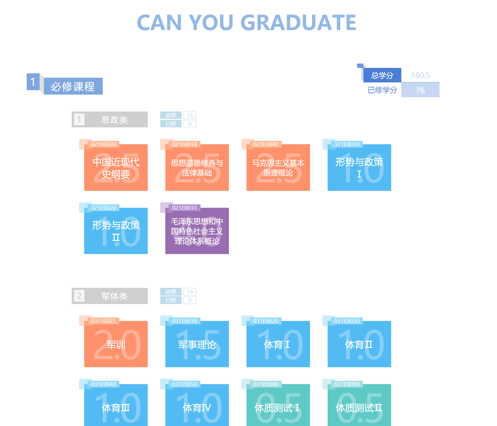

# CanYouGraduate?

##Preview




## Continue

This project __won't__ be continue.

Because I have lost my girlfriend who is the designer in this project.


## Build Setup

> This is a Vue.js project generated by vue-cli

``` bash
# install dependencies
npm install

# serve with hot reload at localhost:8080
npm run dev

# build for production with minification
npm run build

# build for production and view the bundle analyzer report
npm run build --report
```

